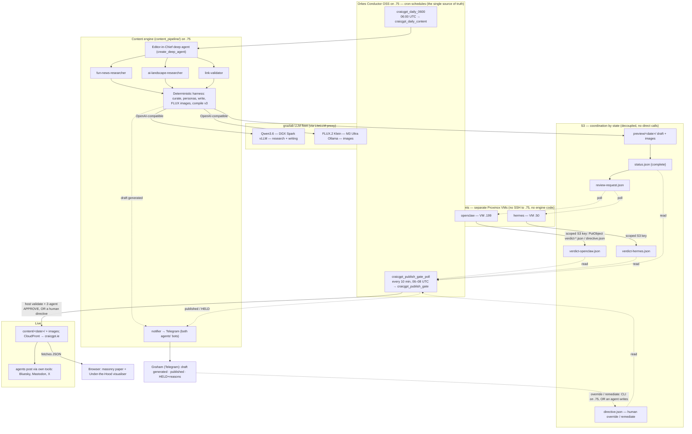
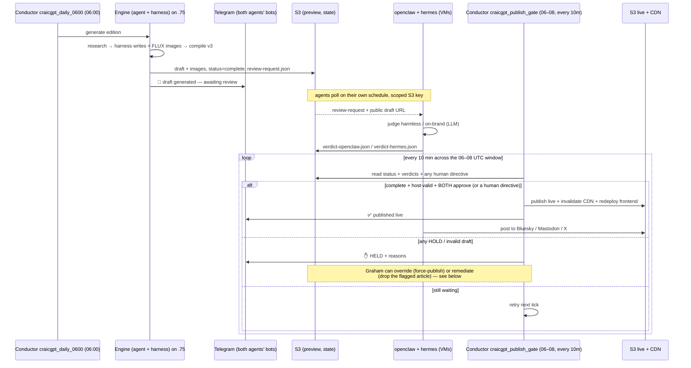

<p align="center">
  
  
</p>

# The Craic Gazette — craicgpt.ie

> *Ireland's Most Artificially Intelligent Newspaper.*
> A daily paper of **fun world news** and **AI-landscape coverage**, written
> overnight by **open-source LLMs** on a homelab GPU fleet, orchestrated by a
> **LangChain deep agent**, and published only after **two independent agents
> (openclaw + hermes) agree it's safe** — no human in the loop at 06:00. It
> doubles as a hands-on **reference for building with LangChain**
> (open-source components only — no proprietary SaaS).

---

## What it is

Every day CraicGPT produces one edition:

- **13 AI stories** — what actually changed in the AI world in the last 24 hours
  (US frontier labs, China, Europe, plus the top AI YouTubers & bloggers),
  written in a cynical, witty Irish house voice: **1 headliner + 2 subarticles +
  10 shorts**, each with a photorealistic image and a validated source link.
- **5 fun stories** — genuinely *positive, non-political* news from around the
  world (the good stuff the doom-cycle drowns out), each rewritten as a tabloid
  piece in the parody voice of a well-known public figure under a punny byline —
  **Ronald Dump**, **Bonio**, **Jeremy Clarkscone**, **Roy Mean**, **Mary
  Whitemouse**, **Hannah Pi**, **A-Dell**, **Ciara Brightly** — with an image and
  a satire disclaimer.

The two tracks are interleaved into one woven edition. Every generated piece
carries a subtle **"generated by `<model>`"** note, and an **"Under the Hood"**
drawer visualises the deep agent's actual run — the lesson, in public.

**Open-source only:** generation runs on **Qwen3.6** (text) and **FLUX.2 Klein**
(images) via a homelab **LiteLLM** proxy; orchestration is **LangChain
`deepagents` + LangGraph**. No LangSmith, no LangGraph Platform.

---

## Architecture

Generation, approval, and publishing are **fully decoupled** — they never call
each other directly, they coordinate through **state files in S3**. Each part
runs (and retries) on its own clock, so a slow generation, a sleepy agent, or a
held edition can never wedge the pipeline.



### Why this shape (the hard-won lesson)

The deep agent reliably does **research** — but is *not* reliable at emitting a
large structured document (a single giant `write_file` tool call gets mangled by
the model's tool-call serialisation). So responsibilities are split:

- **The agent does open-ended research** → writes candidate JSON files.
- **A deterministic harness does the mechanical work** — dedupe, continent/topic
  diversity, link validation, persona assignment, **article writing via small
  plain-chat→JSON calls**, FLUX image generation, schema assembly, attribution.

This is faster (~13 min vs ~24), reliable, and trivially parallelisable across
the fleet. It's the `deciding-deterministic-vs-llm` principle in practice.

---

## The daily workflow

Graham is asleep or commuting at 06:00, so **two independent agents agreeing is
the safety gate that replaces the human**. The agents own the *harmless /
on-brand* judgement; the host owns the deterministic *technically valid* check
and the publish itself.



| Stage | Where | What |
|------|-------|------|
| Generate | Conductor `craicgpt_daily_0600` @ 06:00 UTC → `craicgpt_generate_daily` worker on `.75` | deep-agent research → harness writes + FLUX images → compile v3 |
| Models | LiteLLM proxy → DGX Spark / M3 Ultra | Qwen3.6, FLUX.2 Klein |
| Signal | `s3://…/preview/YYYY/MM/DD/` | `status.json {complete}` + `review-request.json` |
| Notify | engine notifier on `.75` → **both agents' Telegram bots** | 📰 on draft generated, ✅ on published, ✋ on HELD (with reasons) — once per edition |
| Judge | openclaw + hermes — separate Proxmox VMs | poll the request, judge harmless, write `verdict-<agent>.json` via a **scoped S3 key** (`PutObject verdict-*.json` / `directive.json` only — can't publish, delete, or touch live) |
| Publish gate | Conductor `craicgpt_publish_gate_poll` every 10 min 06–08 UTC → `craicgpt_publish_gate` worker on `.75` | idempotent: host-side `validate` + **two-agent consensus** (or a human directive) → publish live + CloudFront invalidation + frontend redeploy; any HOLD/invalid → Telegram; else retry |
| Override | `directive.json` in `preview/<date>/` | human-in-the-loop: force-publish over a HOLD, or remediate (drop the flagged article) — see below |
| Live | `s3://…/content/…` + CloudFront | live at craicgpt.ie; agents post to socials |

> **Why a poll, not a chain?** Nothing pings anything. The generator just drops
> files; the approval agents and the Conductor publish gate each wake on their
> own schedule and read S3. A missed generation, a slow agent, or a held edition
> simply means the next poll finds nothing to do — there is no fragile hand-off
> to break. **Conductor** (Orkes OSS, on `.75`) is the scheduler and the single
> place to see/manage these jobs; it replaced the earlier systemd timers so the
> whole flow is observable and retriable from one console.

---

## Overriding a held edition (human-in-the-loop)

The two-agent gate is deliberately conservative — **any** HOLD keeps the edition
off the site, and the host's structural check is a second veto. That's right for
an unattended 06:00 run, but Graham is the editor-in-chief: when he disagrees, he
can override. The override is **decoupled exactly like everything else** — it's a
small `directive.json` in `preview/<date>/` that the publish gate honours on its
next poll. Two modes:

| Mode | Command | Effect |
|------|---------|--------|
| **Override** | `cli override --date <d> --publish` | Force-publish over the agents' HOLD. **Still requires host-side structural validity** — you override the *harmless/on-brand* judgement, not a structurally broken page. |
| **Remediate** | `cli remediate --date <d> --drop "<title>" --publish` | Act on the agents' recommendation: drop the flagged article(s) by title, **re-validate**, then publish the cleaned edition. |
| Inspect / cancel | `cli directive --date <d> [--clear]` | Show or remove a pending directive. |

Two ways to drive it, same `directive.json` contract:

- **Directly on `.75`** — Graham runs `cli override` / `cli remediate` (writes the
  directive and, with `--publish`, enacts it immediately).
- **Via an agent (Telegram)** — Graham replies to the HOLD alert; the agent writes
  `directive.json` (its scoped S3 key allows it) and fires a one-off Conductor
  `craicgpt_publish_gate` run so it takes effect at once rather than next morning.

A force-publish records *who* overrode and surfaces it in the ✅ published Telegram
alert (`override by …` / `remediated: dropped N`), so an override is never silent.

### The Conductor workflows

| Workflow | Schedule | Worker (on `.75`) | Does |
|----------|----------|-------------------|------|
| `craicgpt_daily_content` | `craicgpt_daily_0600` — `0 0 6 * * ? *` | `craicgpt_generate_daily` | generate the edition + publish the draft to `preview/` |
| `craicgpt_publish_gate` | `craicgpt_publish_gate_poll` — `0 5/10 6-8 * * ? *` | `craicgpt_publish_gate` | the idempotent gate: validate + consensus (or honour a directive) → publish live |

Workflow + schedule JSON live in the `grazlab-llm-fleet` repo
(`workflows/`, `conductor/triggers/schedules/`); the workers are thin — they shell
out to `python -m content_pipeline.agent.cli` on `.75`, so all the orchestration
and judgement stay in this engine, not in Conductor.

---

## Repo layout

```
content_pipeline/
  agent/            deep agent: editor_in_chief, subagents, tools, hitl, trace
  research/         curation.py - dedupe, diversity, link-validate, topic cap
  generate/         writer.py (articles), personas.py (parody voices), images.py (FLUX)
  providers/        litellm.py - LiteLLM proxy client + local-first/frontier fallback
  compile.py        schema-v3 assembly + fun/AI interleaving
  content_config.py env-driven config (routes, prefixes)
  main.py           CLI: run / approve / publish
frontend/           static site (S3+CloudFront): masonry paper + agent visualiser
tests/              pytest suite (offline; network injected)
docs/               LangChain tutorial chapters
```

The published `paper_content.json` schema is documented in `CLAUDE.md`.

---

## Running it

```bash
pip install -r content_pipeline/requirements.txt        # langchain, langgraph, deepagents…
export LITELLM_BASE_URL=https://llm.grazlab.thescriptingpaddy.com/v1

python -m content_pipeline.agent.cli run --dry-run      # generate a draft to /tmp
python -m content_pipeline.agent.cli approve --date <d> # publish an approved draft live

pytest tests/                                           # the suite (offline)

# preview the frontend against a generated edition:
cd frontend && python3 -m http.server 8000             # → http://localhost:8000
```

Configuration is entirely environment-driven (see `content_config.py`): the
write/brain model, image model, S3 bucket, and preview prefix are all overridable.

---

## Tech stack

- **LangChain `deepagents` + LangGraph** (OSS) — planning, subagents, virtual FS.
- **Qwen3.6** (text) + **FLUX.2 Klein** (images) via **LiteLLM** on a DGX Spark +
  M3 Ultra homelab fleet.
- **Orkes Conductor OSS** on the engine host — the scheduler + single console for
  the daily flow: `craicgpt_daily_0600` (06:00 generate) and
  `craicgpt_publish_gate_poll` (06–08 UTC idempotent publish gate), each decoupled
  via S3 state. (Replaced the original systemd timers.)
- **Two-agent approval + human override** — openclaw + hermes (separate Proxmox
  VMs) judge harmless and write verdicts with a least-privilege S3 key; the host
  gate publishes on consensus. Graham can override or remediate a HOLD via an S3
  `directive.json` (CLI on `.75` or an agent on Telegram).
- **Telegram notifications** — the engine fans draft-generated / published / HELD
  alerts to both agents' bots, so an editorial HOLD is never silent.
- **AWS S3 + CloudFront** — static hosting; **boto3** publish.
- **pytest** — fully offline test suite (~125 tests).

---

## Credits

Built by **Graham Land** — *Geek with the Peak / The Scripting Paddy* —
[allthingscloud.eu](https://allthingscloud.eu). The codebase is heavily commented
as a LangChain teaching reference; see `docs/`.

*Parody bylines are satire of public figures and not affiliated with them.*
