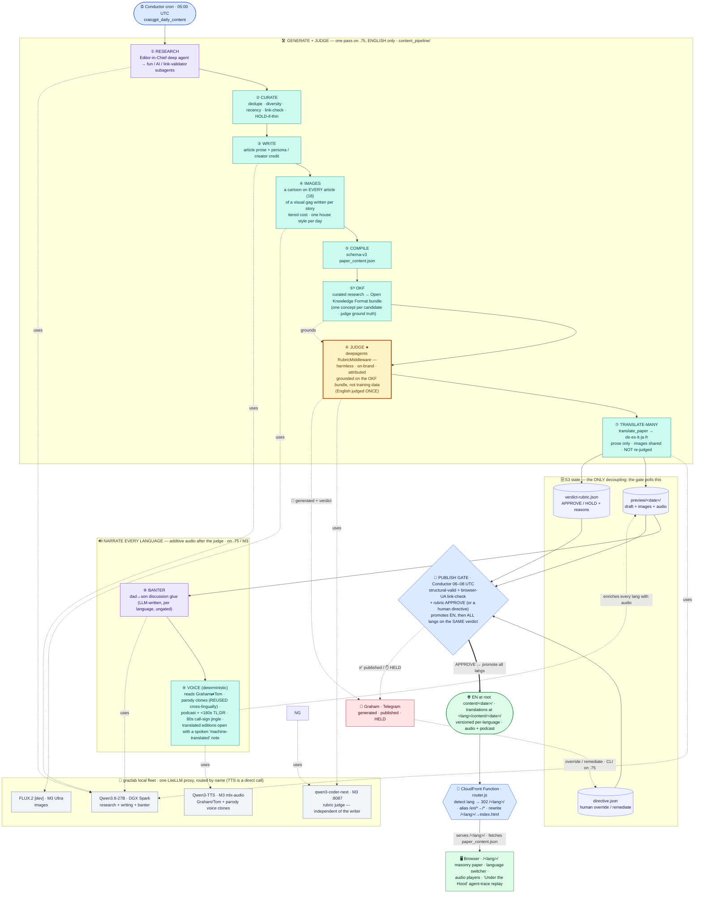
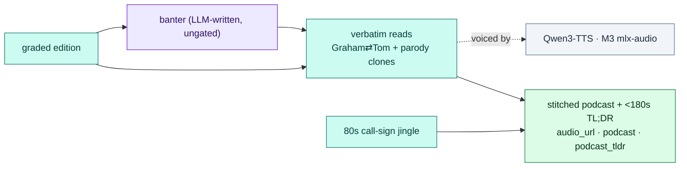
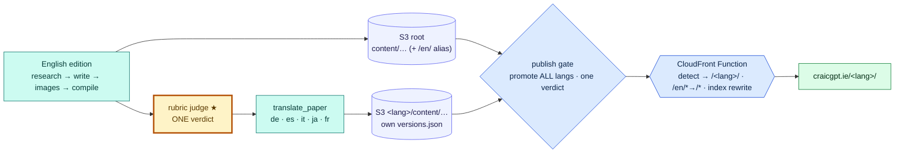

<p align="center">
  
  
</p>

# The Craic Gazette — craicgpt.ie

> *Ireland's Most Artificially Intelligent Newspaper.*
> A daily paper of **fun world news** and **AI-landscape coverage**, written
> overnight by **open-source LLMs** on a homelab GPU fleet, orchestrated by a
> **LangChain deep agent**, and published only after an **in-pipeline LangChain
> rubric judge** grades it harmless and on-brand — no human in the loop at 06:00.
> It doubles as a hands-on **reference for building with LangChain**
> (open-source components only — no proprietary SaaS).

---

## What it is

Every day CraicGPT produces one edition:

- **13 AI stories** — what actually changed in the AI world in the last 24 hours
  (US frontier labs, China, Europe, plus the top AI YouTubers & bloggers),
  written in a cynical, witty Irish house voice: **1 headliner + 2 subarticles +
  10 shorts**, each with a photorealistic image and a validated source link.
- **5 fun stories** — genuinely *positive, non-political* news from around the
  world (the good stuff the doom-cycle drowns out), each rewritten as a tabloid
  piece in the parody voice of a well-known public figure under a punny byline —
  **Ronald Dump**, **Bonio**, **Roy Mean**, **A-Dell**, **Jack Blarney**, **Jeremy
  Clarkscone**, **Jessie Buckled**, **Saoirse Ronaround**, **Sharon Horrigan**,
  **Rogue Williams**, **Keira Knightleigh** — with an image, a satire disclaimer, and
  (in the audio edition) a **voice clone** that reads the piece in character.

The two tracks are interleaved into one woven edition. Every generated piece
carries a subtle **"generated by `<model>`"** note, and an **"Under the Hood"**
drawer visualises the deep agent's actual run — the lesson, in public.

**Every article gets a cartoon — of a joke, not of the headline.** All 18 pieces carry an
illustration drawn from a one-line **visual gag** invented for that story, rather than a literal
rendering of its title. The paper wears **one cartoon style per edition**, cycling daily through
four looks — Beano/Dandy, flat 2D TV, Saturday-morning, and plasticine stop-motion — on a true
day-ordinal rotation, so consecutive editions never repeat and a week shows the full range.

Cost is **tiered**, because 18 images at full quality would not fit the daily budget: the
headliner and both subarticles render at 1024² / 28 steps (~12 min each), the Craic & Throttle
desk at 1024² / 8 steps, and the ten AI shorts as 512² spot thumbnails. That is ~67 minutes of
GPU against a 180-minute task cap. Text is permitted **only** on the 28-step heroes — at 8 steps
the lettering mangles, and a misspelled word reads as broken in a way a misshapen elbow never
does.

**Open-source only:** generation runs on **Qwen3.8-27B** (text, NVFP4 on the DGX Spark) and
**FLUX.2 [dev]** (images, BF16 via ComfyUI on the M3 Ultra), and the daily **voice clones** on **Qwen3-TTS** (M3 mlx-audio), all via a
homelab **LiteLLM** proxy (TTS is a direct call — see *Audio & podcast* below);
orchestration *and the edition judge* are **LangChain `deepagents` + LangGraph** — the
rubric judge runs in-pipeline on an **independent** local model (`qwen3-coder-next`,
distinct from the writer, so it's a true second opinion). No LangSmith, no LangGraph
Platform.

---

## Architecture

The edition is **built and judged in one pass**, then **published by a separate,
decoupled gate**. Generation runs the research → harness → compile pipeline and
then grades the finished edition *inline* with a **LangChain rubric judge** (a
`deepagents` `RubricMiddleware` grader on a local model); the result is
a draft plus a `verdict-rubric.json` in S3. A Conductor **publish gate** wakes on
its own schedule, re-checks that state deterministically, and promotes the edition
live. The two halves never call each other — they coordinate through **state files
in S3** — so a slow generation or a held edition can never wedge the pipeline.

> **What changed:** the old design had a *third* decoupled stage — two approval
> agents (openclaw + hermes) on separate VMs that polled the draft and voted. That
> is **retired.** LangChain's rubric capability folds the *harmless / on-brand /
> attributed* judgement back **into the generation pipeline** as a single in-pipeline
> grader, removing two VMs, two S3 verdict files,
> and a whole coordination hop.



> **Colour key** — 🟣 violet = **LLM / agent** work · 🟢 teal = **deterministic
> harness** (plain code) · 🟡 gold ★ = the **rubric judge** · 🔵 blue =
> **Conductor** schedules / the **edge router** · 🔷 indigo = **S3 state** · 🟢 green = **live**.
> Read it as one spine: the agent only *researches* (①), code does every mechanical step (②–⑤),
> then an **independent** model judges (⑥) **English once** before anything reaches S3 —
> every other language is a deterministic **translation of the compiled English edition** (⑦),
> not a fresh generation, and inherits that one verdict. Narration (⑧–⑩) then adds audio for
> **every** language (clones reused cross-lingually) — the dad↔son banter is the only new
> probabilistic text, so it passes the **same** rubric (⑨) before it's voiced. The publish gate
> promotes all languages on the single English verdict; a **CloudFront Function** then routes
> `/en/`-alias + `/<lang>/` URLs at the edge. The publish gate is the single place the flow is decoupled.

### Why this shape (the hard-won lesson)

The deep agent reliably does **research** — but is *not* reliable at emitting a
large structured document (a single giant `write_file` tool call gets mangled by
the model's tool-call serialisation). So responsibilities are split:

- **The agent does open-ended research** → writes candidate JSON files.
- **A deterministic harness does the mechanical work** — dedupe, continent/topic
  diversity, link validation, persona assignment, **article writing via small
  plain-chat→JSON calls**, FLUX.2 image generation, schema assembly, attribution.
  The cartoons' **style, size and step count are all code**; the model is asked for exactly
  one thing — the joke.

This is faster (~13 min vs ~24), reliable, and trivially parallelisable across
the fleet. It's the `deciding-deterministic-vs-llm` principle in practice.

### Audio & podcast — the same split, in sound

After the judge, a **narration** pass (`generate/narration.py`) turns the graded edition
into audio. It's the cleanest worked example of this repo's whole thesis — *plain code does
the deterministic work; a `deepagents` rubric governs the probabilistic work* — so it gets
its own chapter in [`docs/06`](docs/06-narration-and-audio.md). In brief:

| Layer | Deterministic? | Made by |
|------|----------------|---------|
| **80s call-sign jingle** bookend + the "Goooood morning, CraicGPT!" cold-open | ✅ a bounced Apple-instrument asset / fixed text | `generate/jingle.py` |
| **Article readings** — Graham & Tom alternating; parody items in their own **voice clone** | ✅ verbatim, already-rubric-approved text | `generate/audio.py` |
| **Dad↔son discussion banter** (links each item to the next) | ❌ LLM-written — the only new, claim-free glue | `write_model`, then **gated** |

- **The voices** are **Qwen3-TTS-12Hz, Full-ICL** clones (a ~40–50s reference WAV + its
  transcript) on the **M3 mlx-audio** server. The clone takes a non-OpenAI body
  (`ref_audio` + `ref_text`), so — unlike chat/images — narration POSTs **straight to the
  M3**, not through the LiteLLM proxy. Graham, Tom and each parody persona have their own
  reference; an item with no deployed clone falls back to a spoken character intro.
- **The jingle** is **our own** 80s synth-pop hook (Am–F–C–G) voiced through Apple's
  built-in sampled GM instruments and bounced offline — recognisable, owned, **zero
  copyright** (it replaced an earlier public-domain trad synth; the renderer ships in
  `generate/jingle_src/`).
- **Where LangChain sits:** it isn't making the audio — it's doing the *judgement and
  routing* around it. `run_with_fallback` keeps banter generation local-first with an honest
  fallback record. The banter ships **ungated** (the per-banter rubric gate was removed
  2026-06-10 as too strict — its false holds cost more banter than they caught harm); the
  finished edition is still rubric-judged, the banter prompt enforces the warm/PG register,
  and a rambling link is dropped deterministically before it is voiced. The per-article
  readings read text the edition rubric already passed.



### Multi-lingual — write-once, translate-many

The paper ships daily in **`CRAICGPT_LANGUAGES`** (default `en,de,es,it,ja,fr` — the
Qwen3-TTS-supported set, so all carry audio). **English is the single editorial source of
truth**: researched, written, **rubric-judged** and link-checked **once**. Every other
language is a deterministic **translation of the *compiled* English edition**
(`generate/translate.py`) — one extra prose pass that keeps the URLs, images, credits and
personas verbatim — **not** a fresh generation, and **not** re-judged: the translations
inherit the single English verdict. Narration then runs for **every** language (the voice
clones are reused cross-lingually; a translated edition's podcast/TL;DR open with a spoken
"machine-translated by `<model>`" note). The publish gate promotes **all** languages on that
one English verdict; its verdict/status control-plane stays language-neutral. It gets its own
chapter in [`docs/07`](docs/07-multilingual.md).

**At the edge:** English lives at the S3 **root** (`content/…`, `/index.html`) and `/en/` is a
**CloudFront alias** to it; translations live under a real `<lang>/content/…` prefix with their
own `versions.json`. A **CloudFront Function** (`infra/cloudfront/router.js`) auto-detects
language on a prefix-less request (`cg_lang` cookie → `Accept-Language` → `en`) and **302**s to
`/<lang>/`, aliases `/en/*`→`/*`, and rewrites `/<lang>/`→`…/index.html`. It's deployed via
`infra/cloudfront/deploy-router.sh` (AWS CLI — **not** `terraform apply`; this checkout has no
state for the live stack), with `hreflang` + `x-default` for SEO.



> **Honest attribution, extended:** each translation stamps `edition.translated_by` with the
> real model — surfaced as a witty footer note + a link to the English original on the page,
> and a short spoken apology at the top of the audio. A translation that can't be parsed
> degrades to readable **English**, it never breaks the page.

---

## The daily workflow

Graham is asleep or commuting at 06:00, so an **in-pipeline rubric judge is the
safety gate that replaces the human**. The judge — a LangChain `deepagents`
`RubricMiddleware` grader on an **independent** local model (`qwen3-coder-next`, distinct
from the writer's Qwen3.8 so it's a genuine second opinion) — owns the *harmless /
on-brand / attributed* judgement at generation time. A **narration** step then turns the
graded edition into sound — per-article readings (Graham & Tom alternating, parody items
in their own voice clones), the rubric-gated dad↔son podcast and a sub-180s TL;DR, all
bookended by the **80s call-sign jingle**. The host's publish gate owns the deterministic
*technically valid + links resolve* check and the publish itself.

```mermaid
sequenceDiagram
    autonumber
    participant T1 as ⏰ Conductor 05:00
    participant E as 🛠️ Engine · .75<br/>(agent + harness + narrate)
    participant G as qwen3-coder-next<br/>independent judge
    participant S as 🗄️ S3 preview state
    participant T2 as 🚦 Conductor gate<br/>06–08 · every 10m
    participant L as 🌐 Live + CloudFront
    participant TG as 📲 Telegram

    rect rgb(237, 233, 254)
    Note over T1,G: ① BUILD + JUDGE + NARRATE — one pass, no human in the loop
    T1->>E: generate edition
    E->>E: research → write + images → compile v3
    E->>G: grade finished edition vs the rubric
    G-->>E: APPROVE / HOLD + per-criterion reasons
    E->>E: narrate — per-article reads (Graham⇄Tom) + parody clones
    E->>E: voice podcast + TL;DR (+ 80s call-sign jingle)
    E->>S: draft + images + audio + verdict-rubric.json (status=complete)
    E->>TG: 📰 draft generated (+ verdict)
    end

    rect rgb(219, 234, 254)
    Note over S,L: ② PUBLISH GATE — decoupled, idempotent poll
    loop every 10 min · 06–08 UTC
        T2->>S: read status + verdict-rubric + directive
        alt complete + valid + links OK + rubric APPROVE
            T2->>L: publish live + invalidate CDN + sync frontend
            T2->>TG: ✅ published live
        else rubric HOLD / invalid draft
            T2->>TG: ✋ HELD + reasons
            Note over T2,S: Graham can override / remediate (CLI on .75)
        else still waiting
            T2->>T2: retry next tick
        end
    end
    end
```

| Stage | Where | What |
|------|-------|------|
| Generate | Conductor `craicgpt_daily_0500` @ 05:00 UTC → `craicgpt_generate_daily` worker on `.75` | deep-agent research → harness writes + images → compile v3 — **English once**; then `translate_paper` → de/es/it/ja/fr (prose only, images shared, not re-judged) |
| Models | LiteLLM proxy → DGX Spark / M3 Ultra | Qwen3.8-27B NVFP4 (research + writing + banter), FLUX.2 [dev] (images), `qwen3-coder-next` (independent rubric judge), Qwen3-TTS (voice clones, direct call) |
| Judge | **in-pipeline, on `.75`** (last build step) | a `deepagents` `RubricMiddleware` grades the finished edition (harmless / on-brand / attributed) on an **independent** local model (`qwen3-coder-next` — distinct from the writer) and writes `verdict-rubric.json`. **No separate review VMs** — this replaces the retired openclaw + hermes consensus |
| Narrate | **after the judge, on `.75` / M3** | per-article readings (Graham⇄Tom; parody items in their own voice clones) + the rubric-gated dad↔son podcast + a <180s TL;DR, all bookended by the **80s call-sign jingle** — additive audio written onto the draft (`generate/narration.py`). **Loops every language** (clones reused cross-lingually; a translated edition opens with a spoken "machine-translated by `<model>`" note) |
| Signal | `s3://…/preview/YYYY/MM/DD/` | `status.json {complete}` + `verdict-rubric.json` |
| Notify | engine notifier on `.75` → **both agents' Telegram bots** | 📰 on draft generated (with the rubric verdict), ✅ on published, ✋ on HELD (with reasons) — once per edition |
| Publish gate | Conductor `craicgpt_publish_gate_poll` every 10 min 06–08 UTC → `craicgpt_publish_gate` worker on `.75` | idempotent: host-side `validate` + browser-UA link-check + **the rubric `APPROVE`** (or a human directive) → publish English live, then **promote every other language on the same verdict** (`_publish_translations_live`, isolated) + CloudFront invalidation + frontend redeploy; any HOLD/invalid → Telegram; else retry |
| Override | `directive.json` in `preview/<date>/` | human-in-the-loop: force-publish over a HOLD, or remediate (drop the flagged article) — see below |
| Live | EN at `s3://…/content/…` (+ `/en/` alias) · translations at `s3://…/<lang>/content/…` + CloudFront **language router** | live at craicgpt.ie/`<lang>`/ |

> **Why a poll, not a chain?** Nothing pings anything. Generation drops the draft
> *and its own rubric verdict*; the Conductor publish gate wakes on its own
> schedule and reads S3. A missed generation or a held edition simply means the
> next poll finds nothing to do — there is no fragile hand-off to break.
> **Conductor** (Orkes OSS, on `.75`) is the scheduler and the single place to
> see/manage these jobs; it replaced the earlier systemd timers so the whole flow
> is observable and retriable from one console.

---

## Overriding a held edition (human-in-the-loop)

The rubric judge is deliberately conservative — a HOLD keeps the edition off the
site, and the host's structural + link check is a second veto. That's right for an
unattended 06:00 run, but Graham is the editor-in-chief: when he disagrees, he can
override. The override is **decoupled exactly like the publish gate** — it's a small
`directive.json` in `preview/<date>/` that the gate honours on its next poll. Two
modes:

| Mode | Command | Effect |
|------|---------|--------|
| **Override** | `cli override --date <d> --publish` | Force-publish over the rubric judge's HOLD. **Still requires host-side structural validity** — you override the *harmless/on-brand* judgement, not a structurally broken page. |
| **Remediate** | `cli remediate --date <d> --drop "<title>" --publish` | Act on the judge's recommendation: drop the flagged article(s) by title, **re-validate**, then publish the cleaned edition. |
| Inspect / cancel | `cli directive --date <d> [--clear]` | Show or remove a pending directive. |

Graham drives it **directly on `.75`** — `cli override` / `cli remediate` writes the
directive and, with `--publish`, enacts it immediately (firing the idempotent gate).
A force-publish records *who* overrode and surfaces it in the ✅ published Telegram
alert (`override by …` / `remediated: dropped N`), so an override is never silent.

### The Conductor workflows

| Workflow | Schedule | Worker (on `.75`) | Does |
|----------|----------|-------------------|------|
| `craicgpt_daily_content` | `craicgpt_daily_0500` — `0 0 5 * * ? *` | `craicgpt_generate_daily` | generate + rubric-judge the edition, then publish the draft + `verdict-rubric.json` to `preview/` |
| `craicgpt_publish_gate` | `craicgpt_publish_gate_poll` — `0 5/10 6-8 * * ? *` | `craicgpt_publish_gate` | the idempotent gate: validate + link-check + the rubric `APPROVE` (or honour a directive) → publish live |

Workflow + schedule JSON live in the `grazlab-llm-fleet` repo
(`workflows/`, `conductor/triggers/schedules/`); the workers are thin — they shell
out to `python -m content_pipeline.agent.cli` on `.75`, so all the orchestration
and judgement stay in this engine, not in Conductor.

---

## Repo layout

```
content_pipeline/
  agent/            deep agent: editor_in_chief, subagents, tools, rubric_review (judge + podcast gate), hitl, trace
  agent/cli.py      CLI: run / narrate / gate / validate / override / remediate / …  (all loop the languages)
  agent/i18n_html.py  per-language frontend/<lang>/{index,about}.html (translated <head> + hreflang)
  research/         curation.py - dedupe, diversity, link-validate, topic cap
  generate/         writer.py (articles, cross-box fallback) · images.py · personas.py (parody roster)
                    translate.py (write-once → translate-many: compiled EN → de/es/it/ja/fr)
                    audio.py + jingle.py (TTS voice clones + 80s call-sign · per-language phonetics + CJK chunking) ·
                    podcast_script.py + narration.py (the dad↔son show + TL;DR · localised, looped per language)
  providers/        litellm.py - LiteLLM proxy client + local-first/cross-box fallback
  compile.py        schema-v3 assembly + fun/AI interleaving
  content_config.py env-driven config (routes, prefixes, languages/source_language)
infra/cloudfront/   router.js (edge language router) + deploy-router.sh (AWS-CLI deploy) + README
frontend/           static site (S3+CloudFront): /<lang>/ masonry paper + language switcher + agent visualiser
terraform/frontend/ S3 + CloudFront + ACM + Route53 (router carried as a NOT-APPLIED note — see infra/cloudfront)
tests/              pytest suite (offline; network injected)
docs/               LangChain tutorial chapters (06 = audio · 07 = multilingual)
```

The published `paper_content.json` schema is documented in `CLAUDE.md`.

---

## Running it

```bash
pip install -r content_pipeline/requirements.txt        # langchain, langgraph, deepagents…
export LITELLM_BASE_URL=https://llm.grazlab.thescriptingpaddy.com/v1

python -m content_pipeline.agent.cli run --dry-run      # generate a draft to /tmp
python -m content_pipeline.agent.cli approve --date <d> # publish an approved draft live

pytest tests/                                           # the suite (offline)

# preview the frontend against a generated edition:
cd frontend && python3 -m http.server 8000             # → http://localhost:8000
```

Configuration is entirely environment-driven (see `content_config.py`): the
write/brain model, image model, S3 bucket, and preview prefix are all overridable.

---

## Tech stack

- **LangChain `deepagents` + LangGraph** (OSS) — planning, subagents, virtual FS,
  and the **`RubricMiddleware`** edition judge.
- **Qwen3.8-27B** (research + writing + banter) + **FLUX.2 [dev]** (images) + **`qwen3-coder-next`**
  (the *independent* rubric judge) via **LiteLLM** on a DGX Spark + M3 Ultra homelab fleet;
  the daily **voice clones** run on **Qwen3-TTS** (M3 mlx-audio, a direct call).
- **Web search** — **Serper.dev** (Google SERP) powers the agent's `web_search` tool
  (2,500/mo free tier). Replaced **Brave Search** in 2026-06: Brave withdrew its free API
  tier (Feb 2026), so the agent's ~80 searches/run 429'd on the new metered quota.
- **Orkes Conductor OSS** on the engine host — the scheduler + single console for
  the daily flow: `craicgpt_daily_0500` (05:00 generate + judge) and
  `craicgpt_publish_gate_poll` (06–08 UTC idempotent publish gate), decoupled via
  S3 state. (Replaced the original systemd timers.)
- **In-pipeline rubric judge + human override** — a `deepagents` `RubricMiddleware`
  grades each finished edition (harmless / on-brand / attributed) on an **independent**
  local model (`qwen3-coder-next` — Qwen3-Coder-Next 80B-A3B on the M3, distinct from the
  writer's Qwen3.8 so it's a genuine second opinion) and writes `verdict-rubric.json`; the
  host gate publishes on the rubric `APPROVE`. **Replaces the retired two-agent (openclaw +
  hermes) consensus.** The *same* middleware also gates the podcast banter. Graham can
  override or remediate a HOLD via an S3 `directive.json` (CLI on `.75`).
- **Audio & podcast (OSS, on-box)** — per-article readings + a rubric-gated dad↔son
  podcast + a <180s TL;DR, voiced by **Qwen3-TTS** Full-ICL **voice clones** (Graham, Tom,
  and a per-persona parody clone) on the M3, bookended by our **own 80s call-sign jingle**
  (Apple sampled instruments, bounced offline — owned, zero-copyright). Additive: an edition
  still validates and renders without audio.
- **Telegram notifications** — the engine fans draft-generated / published / HELD
  alerts to both agents' bots, so an editorial HOLD is never silent.
- **Multi-lingual — write-once, translate-many** — English is researched, written, judged
  and link-checked **once**; every other language in **`CRAICGPT_LANGUAGES`**
  (`en,de,es,it,ja,fr`) is a deterministic **translation of the compiled English edition**
  (`generate/translate.py`), narrated cross-lingually, and promoted on the **single English
  verdict**. Honest attribution extends to it: each page stamps `edition.translated_by`.
- **AWS S3 + CloudFront** — static hosting; **boto3** publish. A **CloudFront Function**
  (`infra/cloudfront/router.js`) routes the per-language URLs at the edge (auto-detect → 302
  `/<lang>/`, `/en/*`→`/*` alias, index rewrite), deployed via AWS CLI (`deploy-router.sh`),
  not `terraform apply`.
- **pytest** — fully offline test suite.

---

## Credits

Built by **Graham Land** — *Geek with the Peak / The Scripting Paddy* —
[allthingscloud.eu](https://allthingscloud.eu). The codebase is heavily commented
as a LangChain teaching reference; see `docs/`.

*Parody bylines are satire of public figures and not affiliated with them.*
