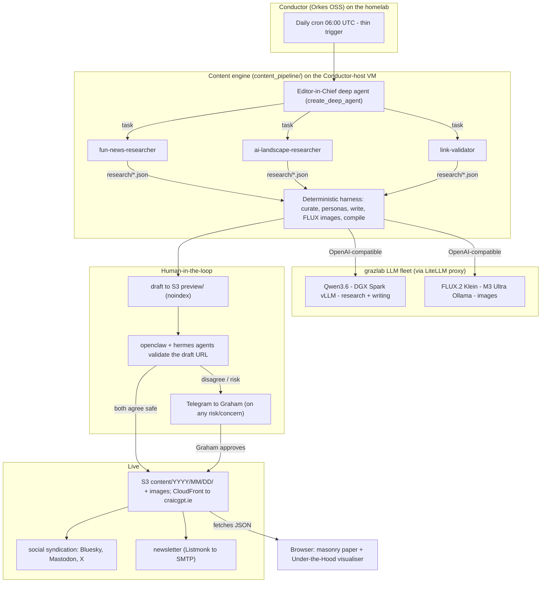
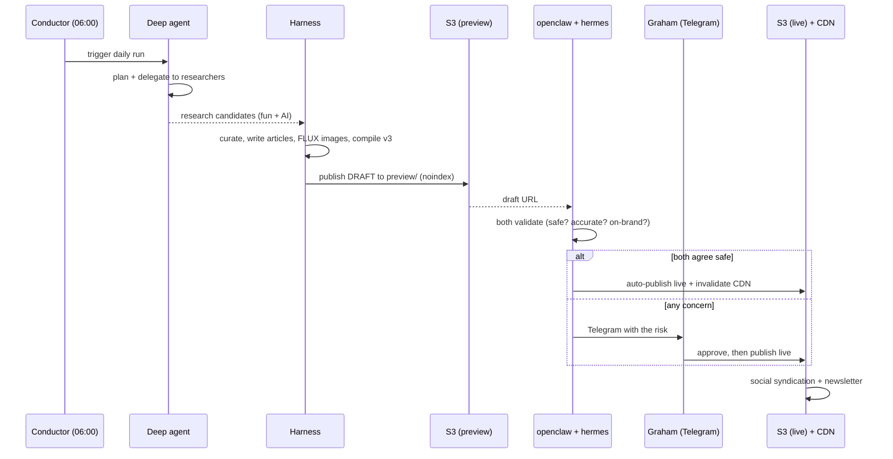

<p align="center">
  
  
</p>

# The Craic Gazette — craicgpt.ie

> *Ireland's Most Artificially Intelligent Newspaper.*
> A daily paper of **fun world news** and **AI-landscape coverage**, written
> overnight by **open-source LLMs** on a homelab GPU fleet, orchestrated by a
> **LangChain deep agent**, and published only after a **human-in-the-loop**
> says so. It doubles as a hands-on **reference for building with LangChain**
> (open-source components only — no proprietary SaaS).

---

## What it is

Every day CraicGPT produces one edition:

- **13 AI stories** — what actually changed in the AI world in the last 24 hours
  (US frontier labs, China, Europe, plus the top AI YouTubers & bloggers),
  written in a cynical, witty Irish house voice: **1 headliner + 2 subarticles +
  10 shorts**, each with a photorealistic image and a validated source link.
- **5 fun stories** — genuinely *positive, non-political* news from around the
  world (the good stuff the doom-cycle drowns out), each rewritten as a tabloid
  piece in the parody voice of a well-known public figure under a punny byline —
  **Ronald Dump**, **Bonio**, **Jeremy Clarkscone**, **Roy Mean**, **Mary
  Whitemouse**, **Hannah Pi**, **A-Dell**, **Ciara Brightly** — with an image and
  a satire disclaimer.

The two tracks are interleaved into one woven edition. Every generated piece
carries a subtle **"generated by `<model>`"** note, and an **"Under the Hood"**
drawer visualises the deep agent's actual run — the lesson, in public.

**Open-source only:** generation runs on **Qwen3.6** (text) and **FLUX.2 Klein**
(images) via a homelab **LiteLLM** proxy; orchestration is **LangChain
`deepagents` + LangGraph**. No LangSmith, no LangGraph Platform.

---

## Architecture



### Why this shape (the hard-won lesson)

The deep agent reliably does **research** — but is *not* reliable at emitting a
large structured document (a single giant `write_file` tool call gets mangled by
the model's tool-call serialisation). So responsibilities are split:

- **The agent does open-ended research** → writes candidate JSON files.
- **A deterministic harness does the mechanical work** — dedupe, continent/topic
  diversity, link validation, persona assignment, **article writing via small
  plain-chat→JSON calls**, FLUX image generation, schema assembly, attribution.

This is faster (~13 min vs ~24), reliable, and trivially parallelisable across
the fleet. It's the `deciding-deterministic-vs-llm` principle in practice.

---

## The daily workflow



| Stage | Where | What |
|------|-------|------|
| Trigger | Conductor `craicgpt-daily` schedule, host `.75` | thin cron @ 06:00 UTC |
| Generate | `content_pipeline/` on `.75` | deep-agent research → harness writes |
| Models | LiteLLM proxy → DGX Spark / M3 Ultra | Qwen3.6, FLUX.2 Klein |
| Draft | `s3://…/preview/YYYY/MM/DD/` | held for approval |
| Approve | openclaw + hermes agents | consensus auto-publish, else Telegram |
| Publish | `s3://…/content/…` + CloudFront | live at craicgpt.ie |

---

## Repo layout

```
content_pipeline/
  agent/            deep agent: editor_in_chief, subagents, tools, hitl, trace
  research/         curation.py - dedupe, diversity, link-validate, topic cap
  generate/         writer.py (articles), personas.py (parody voices), images.py (FLUX)
  providers/        litellm.py - LiteLLM proxy client + local-first/frontier fallback
  compile.py        schema-v3 assembly + fun/AI interleaving
  content_config.py env-driven config (routes, prefixes)
  main.py           CLI: run / approve / publish
frontend/           static site (S3+CloudFront): masonry paper + agent visualiser
tests/              pytest suite (offline; network injected)
docs/               LangChain tutorial chapters
```

The published `paper_content.json` schema is documented in `CLAUDE.md`.

---

## Running it

```bash
pip install -r content_pipeline/requirements.txt        # langchain, langgraph, deepagents…
export LITELLM_BASE_URL=https://llm.grazlab.thescriptingpaddy.com/v1

python -m content_pipeline.agent.cli run --dry-run      # generate a draft to /tmp
python -m content_pipeline.agent.cli approve --date <d> # publish an approved draft live

pytest tests/                                           # the suite (offline)

# preview the frontend against a generated edition:
cd frontend && python3 -m http.server 8000             # → http://localhost:8000
```

Configuration is entirely environment-driven (see `content_config.py`): the
write/brain model, image model, S3 bucket, and preview prefix are all overridable.

---

## Tech stack

- **LangChain `deepagents` + LangGraph** (OSS) — planning, subagents, virtual FS,
  `interrupt()` human-in-the-loop.
- **Qwen3.6** (text) + **FLUX.2 Klein** (images) via **LiteLLM** on a DGX Spark +
  M3 Ultra homelab fleet.
- **Orkes Conductor** (OSS) — the daily cron trigger.
- **AWS S3 + CloudFront** — static hosting; **boto3** publish.
- **pytest** — fully offline test suite.

---

## Credits

Built by **Graham Land** — *Geek with the Peak / The Scripting Paddy* —
[allthingscloud.eu](https://allthingscloud.eu). The codebase is heavily commented
as a LangChain teaching reference; see `docs/`.

*Parody bylines are satire of public figures and not affiliated with them.*
