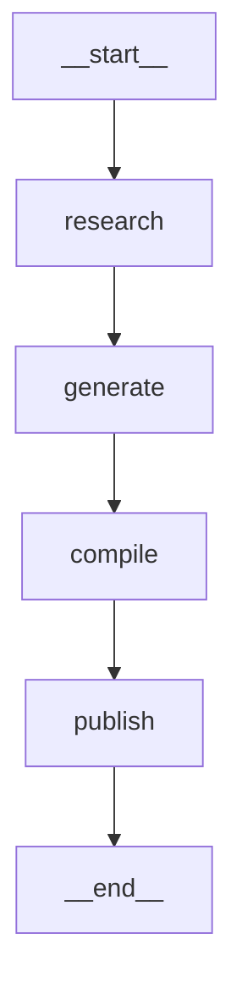

# 03 — LangGraph Workflow

## What is LangGraph?

LangGraph extends LangChain to build **stateful, multi-step workflows** as explicit graphs.

Unlike a simple LCEL chain (`A | B | C`), a LangGraph `StateGraph` lets you:

- Define state as a typed dictionary that flows between nodes
- Add conditional edges (branch based on state values)
- Handle retries and error recovery
- Visualise the execution graph as a Mermaid diagram
- Support human-in-the-loop checkpointing (pause and resume)

---

## The Craic Gazette Pipeline Graph



Run `python content_pipeline/main.py --show-graph` to generate this diagram live.

---

## State: The TypedDict Contract

State is the data structure that flows between nodes. Each node receives the
full current state and returns a **dict of fields to update** (not the whole state).

```python
# content_pipeline/agents/orchestrator.py

class PipelineState(TypedDict, total=False):
    target_date:   date         # Set at pipeline start
    date_iso:      str          # "2026-03-03"
    context:       dict         # Populated by [research]
    raw_articles:  dict         # Populated by [generate]
    paper_content: dict         # Populated by [compile]
    published:     bool         # Set by [publish]
    s3_key:        str          # Set by [publish]
    errors:        list[str]    # Accumulated across all nodes
```

**Key insight:** Each node only returns the fields it changes.
LangGraph merges returned fields into the existing state — other fields remain.

```python
# The research node only sets 'context' — other fields are untouched
def node_research(state: PipelineState) -> dict:
    context = run_research_agent(state["target_date"])
    return {"context": context}   # ← Only return what changed
```

---

## Nodes: Plain Python Functions

Each node is just a function that takes state and returns a partial state update.
No special base class, no decorators — just functions.

```python
def node_research(state: PipelineState) -> dict:
    """NODE 1: Fetch news and weather via ReAct agent."""
    context = run_research_agent(state.get("target_date"))
    return {"context": context}

def node_generate(state: PipelineState) -> dict:
    """NODE 2: Run RunnableParallel across Claude, Gemini, Local."""
    results = run_parallel_generation(
        inputs=build_inputs(state["context"]),
        claude_llm=get_claude_llm(),
        gemini_llm=get_gemini_llm(),
        local_llm=get_lmstudio_llm(),
    )
    return {"raw_articles": results}

def node_compile(state: PipelineState) -> dict:
    """NODE 3: Assemble paper_content.json."""
    paper = assemble_paper(state["raw_articles"], state["context"])
    return {"paper_content": paper}

def node_publish(state: PipelineState) -> dict:
    """NODE 4: Upload to S3."""
    s3_key = publish_to_s3(state["paper_content"], state["date_iso"])
    return {"published": True, "s3_key": s3_key}
```

---

## Building and Compiling the Graph

```python
from langgraph.graph import StateGraph, START, END

builder = StateGraph(PipelineState)    # ← Tells LangGraph about state shape

# Register nodes
builder.add_node("research", node_research)
builder.add_node("generate", node_generate)
builder.add_node("compile",  node_compile)
builder.add_node("publish",  node_publish)

# Define edges (execution order)
builder.add_edge(START,      "research")
builder.add_edge("research", "generate")
builder.add_edge("generate", "compile")
builder.add_edge("compile",  "publish")
builder.add_edge("publish",  END)

# Compile validates the graph and returns a runnable
graph = builder.compile()
```

---

## Running the Pipeline

```python
# Initial state — only the fields the first node needs
initial_state = {
    "target_date": date(2026, 3, 3),
    "date_iso":    "2026-03-03",
    "errors":      [],
}

# invoke() runs the full graph and returns the final state
final_state = graph.invoke(initial_state)

print(final_state["published"])   # → True
print(final_state["s3_key"])      # → "content/2026/03/03/paper_content.json"
print(final_state["errors"])      # → [] (hopefully)
```

---

## Conditional Edges (not used here, but important to know)

For branching workflows, use `add_conditional_edges`:

```python
def should_retry(state: PipelineState) -> str:
    """Return the name of the next node based on state."""
    if state.get("errors") and len(state["errors"]) < 3:
        return "generate"   # retry
    return "compile"        # continue

builder.add_conditional_edges(
    "generate",             # From this node
    should_retry,           # Call this function to decide
    {
        "generate": "generate",  # If it returns "generate" → loop back
        "compile":  "compile",   # If it returns "compile" → continue
    }
)
```

---

## Where to Find This in the Craic Gazette

| Concept               | File                                             |
|-----------------------|--------------------------------------------------|
| StateGraph definition | `content_pipeline/agents/orchestrator.py`        |
| All four nodes        | `content_pipeline/agents/orchestrator.py`        |
| Pipeline runner       | `content_pipeline/agents/orchestrator.py:run_pipeline()` |
| Graph visualisation   | `python content_pipeline/main.py --show-graph`   |

---

## Why LangGraph Over Sequential Function Calls?

| Aspect              | Sequential calls              | LangGraph StateGraph              |
|---------------------|-------------------------------|-----------------------------------|
| Visualisation       | Manual diagram in a doc       | Auto-generated Mermaid graph      |
| Error handling      | Try/except around each call   | Per-node, state carries errors    |
| Checkpointing       | Not possible                  | Built-in (add a checkpointer)     |
| Testing             | Mock whole pipeline           | Test each node function in isolation |
| Extending           | Add more functions + wire up  | Add node + add_edge               |
| Learning value      | Implicit flow                 | Explicit, inspectable graph       |

For a tutorial site, the explicit graph is far more educational.
