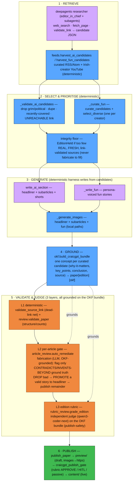

# Content generation & validation — the CraicGPT edition pipeline

How the daily edition is **retrieved → selected & prioritised → generated → grounded
(OKF) → validated & judged → published**. A LangChain **deep agent** does research
*only*; a deterministic harness writes the articles; the research is serialized to an
**OKF research bundle**; and three independent gates — all grounded on that bundle —
stand between a draft and the live site. Conductor is a thin trigger
(`craicgpt_generate_daily` → `craicgpt_narrate` → `craicgpt_publish_gate`); the
orchestration lives in `content_pipeline/agent/editor_in_chief.py:run_edition`.

> Sibling pipeline: thegeekwiththepeak.com runs the same shape. See its
> `docs/content-generation-and-validation.md`. The two are kept at parity — a
> gate/validation fix to one is applied to both.

## 1 · Retrieve — `agent/editor_in_chief.py`, `agent/subagents.py`, `research/feeds.py`

- **Deep-agent research** — `build_editor_in_chief` assembles a `deepagents`
  agent whose subagents (`AI_LANDSCAPE_RESEARCHER`, `FUN_NEWS_RESEARCHER`) use
  `web_search` (Serper) · `fetch_page` · `validate_link` and write **candidate JSON**
  to the agent's virtual filesystem (`research/ai_candidates.json`,
  `research/fun_candidates.json`). The agent researches only; it does not write the paper.
- **Deterministic harvest** — `run_edition` merges in `feeds.harvest_ai_candidates`
  (curated lab/company/Substack/arXiv RSS) and `feeds.harvest_fun_candidates`
  (Irish-creator YouTube), retried (`_harvest_with_retry`) so a transient blip
  self-heals. This guarantees the desks never starve on the agent's yield alone.

AI candidate shape: `{title, summary, source_url, why_it_matters, key_points[], conclusion}`.

## 2 · Select & prioritise — `agent/editor_in_chief.py`, `research/curation.py`, `recency.py`

- **`_validate_ai_candidates`** — drop grim/political (`is_excluded_by_keywords`),
  recently-covered (`recency`), duplicate URLs, and any whose `source_url` **doesn't
  resolve** (`validate_source_link`), **preserving** each candidate's rich shape.
- **`_curate_fun`** — `curate_candidates` + `select_diverse` (spread one pick per
  creator; carry the creator credit).
- **Integrity floor** — below `min_ai_sources` real/fresh/reachable sources →
  `EditionHeld`. Fabrication is structurally impossible: the writer only ever sees
  reachable, curated sources; a degraded search HOLDs rather than inventing
  (the 2026-06-04 guard). The fun desk floor is soft (never holds the paper).

## 3 · Generate — `generate/writer.py`, `agent/editor_in_chief.py`

The harness writes the paper deterministically from the validated candidates (the
agent's single giant write was unreliable):

- **`write_ai_section(ai_valid, …)`** — one headliner + N subarticles + M shorts,
  each drawing on its candidate's `key_points`/`conclusion`; `_snap_ai_sources` pins
  every written URL onto a validated candidate so no invented link slips through.
- **`_write_fun(fun_picks, …)`** — each fun story in its assigned persona's voice,
  with `_finalize_fun` stamping credit/disclaimer.
- **`_generate_images`** — images for the headliner + **subarticles** + fun (shorts
  carry none). NOTE: these are **local paths** until publish (see §6).

## 4 · Ground (OKF) — `content_pipeline/okf/`

`run_edition` calls **`build_craicgpt_bundle(ai_valid, fun_picks, date)`** → an OKF
v0.1 bundle, **one concept per curated candidate** (`AI Story`/`Fun Story`; body =
why-it-matters + key_points + conclusion; `resource`/citation = the source URL;
creator credit on fun). It is attached to **`paper["edition"]["okf"]` BEFORE the
gates** so both grounded gates read the same research. Concepts join to articles by
`source_url`.

## 5 · Validate & judge — three independent layers (in `run_edition`, before narration)

- **L1 — deterministic** (`research/curation.validate_source_link` +
  `agent/review.validate_paper`): dead/unreachable links; structure + counts
  (headliner needs title/body/source/image; ≥2 subarticles, ≥8 shorts; every fun item
  credited or marked parody). At GATE time images are still local paths, so
  `validate_paper(require_http_images=False)` checks image **presence**; the publish
  gate re-checks http after upload.
- **L2 — per-article gate** (`agent/article_review.auto_remediate`): one batched LLM
  grade (`grade_articles` + `_FABRICATION_PROMPT`) reads each article's **OKF GROUND
  TRUTH** (the code-verified, link-validated research it was written from, treated as
  **authoritative**) and flags only prose that **contradicts or invents beyond** it —
  so a true-but-recent story is never false-flagged against training data. Bad
  articles are **dropped and the valid remainder published**; a fabricated headliner
  **promotes a valid story** to lead (`_pick_promotion` — a present image, local or
  http, qualifies; if a promoted lead lacks an image, `run_edition` regenerates one).
  It hard-holds **only** when nothing valid remains or the structural floor can't be met.
- **L3 — edition rubric** (`agent/rubric_review.grade_edition`): an independent judge
  (a different family from the writer — `qwen3-coder-next`, frontier fallback) grades
  the finished edition against `EDITION_RUBRIC`, grounded on the flattened OKF bundle —
  a publish-**safety** check (harmless / on-brand / attributed / substantive), not a
  fact re-check.

## 6 · Publish — `agent/publish.py`, `agent/cli.py`, `agent/review.py`

`publish_paper(paper, date, live=False)` uploads images to S3 (rewriting `image_url`
local→`https`) and writes the draft to `preview/` plus a `verdict-rubric.json`. The
decoupled **`craicgpt_publish_gate`** (idempotent poll, `review.gate`) promotes to
`content/` (live) on the rubric **APPROVE** + host structural re-validation (now with
http images) + browser-UA link-check; a judgement HOLD escalates to Graham on Telegram
and passively auto-publishes after the HITL window (a human directive can
force/remove/hold). Translations and the rubric-gated podcast are additive tails.

## Why this shape

Deterministic where correctness matters (research validation, ranking, structure +
link checks, the OKF bundle); probabilistic only for prose. The OKF bundle means both
the per-article gate and the edition rubric verify claims against **the research that
produced them**, not their training data — which is what stopped a true current-year
story being false-HELD as fabricated (2026-06-17; see
`docs/adr/0003-okf-research-grounding.md`).
